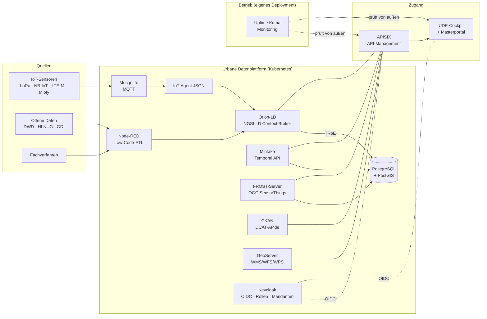

# Urbane Datenplattform (UDP) auf FIWARE-Basis

Offene, modulare und **mandantenfähige** urbane Datenplattform für Smart-City-
und Smart-Region-Projekte – entwickelt als Referenzimplementierung zu den
Anforderungen der Leistungsbeschreibung **60982-25** (Abschnitt B.II „Urbane
Datenplattform – Kommunale Anwendung“), ohne den fachspezifischen Teil
Starkregen-Frühalarmsystem.

**Lizenz: [EUPL-1.2](LICENSE)** („Public Money – Public Code“) ·
Architektur konform zu **DIN SPEC 91357** (Referenzarchitekturmodell Offene
Urbane Plattformen) · durchgängig **Open Source**.

## Schnellstart

```bash
cd gui && npm ci && npm run build && cd ..     # GUI bauen
cd platform
cp .env.example .env                           # Zugangsdaten anpassen!
docker compose up -d
```

Die Host-Ports sind in `platform/.env.example` vorgegeben und dort anpassbar;
alle Fach-APIs laufen gebündelt über das API-Gateway:

| Oberfläche / Schnittstelle | URL |
|---|---|
| **UDP-Cockpit (zentrale GUI)** | http://localhost:3700 |
| API-Gateway (alle Plattform-APIs) | http://localhost:8780 |
| NGSI-LD Context Broker | http://localhost:8780/ngsi-ld/v1/ |
| NGSI-LD Temporal API (Mintaka) | http://localhost:8780/temporal/ |
| OGC SensorThings API (FROST) | http://localhost:8780/FROST-Server/v1.1/ |
| CKAN Open-Data-Portal (DCAT-AP) | http://localhost:8780/catalog |
| GeoServer (WMS/WFS/WPS) | http://localhost:8780/geoserver |
| Masterportal (Profil viz-extra) | http://localhost:8780/portal |
| IoT-Provisionierung / HTTP-Ingest | http://localhost:8780/iot bzw. /ingest |
| Node-RED (Low-Code-ETL) | http://localhost:4900 |
| Keycloak (Benutzer/Rollen/Mandanten) | http://localhost:8700 |
| PostgreSQL/PostGIS | localhost:5439 |

MQTT (Mosquitto) ist bewusst **nicht** am Host veröffentlicht – Sensoren bzw.
LoRaWAN-Network-Server sprechen den Broker im Plattform-Netz an. Für lokale
Tests: `docker run --rm --network udp eclipse-mosquitto:2.0 mosquitto_pub -h mosquitto -t test -m hallo`
oder Port-Mapping in einer Compose-Override-Datei ergänzen.

Optionale Profile: `--profile viz-extra` (Masterportal, vorher
`./scripts/get-masterportal.sh`), `--profile analytics` (Apache Superset,
Port 8781).

Produktionsbetrieb erfolgt auf **Managed Kubernetes** – siehe
[`helm/udp/DEPLOY.md`](helm/udp/DEPLOY.md).

### Monitoring (eigenes Deployment)

Das Verfügbarkeits-Monitoring (Uptime Kuma, <http://localhost:3701>) liegt
bewusst **außerhalb** dieses Stacks in [`monitoring/`](monitoring/README.md):
Ein Monitoring, das mit der überwachten Plattform startet, stoppt und ausfällt,
kann deren Ausfall nicht melden.

```bash
cd monitoring && cp .env.example .env && docker compose up -d   # Compose
helm -n udp-monitoring upgrade --install uptime-kuma monitoring/helm/uptime-kuma \
  --create-namespace                                            # Kubernetes
```

### Deployment auf einen Host

Repository per SSH-Deploy-Key holen und den Stack einrichten — idempotent,
beliebig wiederholbar:

```bash
git clone git@github-udp:idk-ev/UDP.git ~/projects/udp   # Deploy-Key in ~/.ssh/config
cd ~/projects/udp
cp platform/.env.example platform/.env                   # Secrets eintragen
bash deploy/deploy.sh
```

Das Skript prüft Voraussetzungen und Secrets, holt den aktuellen Stand
(`--no-pull` überspringt das), erzeugt die generierten Artefakte
(City-Pages, Node-RED-Flows, GUI-Build), richtet den systemd-User-Service samt
Lingering ein, startet den Stack und fährt einen Rauchtest über Kontext-API,
Temporal-API, CKAN und die Dashboards. Die Unit liegt versioniert unter
[`deploy/systemd/`](deploy/systemd/udp-stack.service).

### Autostart nach Reboot (ohne Login)

Der Stack startet auf diesem Host automatisch nach einem Neustart, zweifach
abgesichert:

1. **Docker-Restart-Policy** `unless-stopped`: Der (rootful) Docker-Daemon
   startet als System-Dienst beim Boot und zieht alle Container wieder hoch.
2. **systemd-User-Service** `udp-stack.service`
   (`~/.config/systemd/user/udp-stack.service`) mit aktiviertem
   **Lingering** (`loginctl enable-linger`): führt beim Boot – ohne
   Benutzeranmeldung – `docker compose … up -d` aus und fängt damit auch den
   Fall ab, dass der Stack zuvor manuell gestoppt wurde.

```bash
systemctl --user status udp-stack     # Status
systemctl --user restart udp-stack    # Stack neu starten
systemctl --user disable udp-stack    # Autostart entfernen
```

## Architektur



Details: [`docs/architektur.md`](docs/architektur.md) ·
Anforderungserfüllung: [`docs/anforderungsabdeckung.md`](docs/anforderungsabdeckung.md) ·
Betrieb/SLA/Backup: [`docs/betrieb.md`](docs/betrieb.md)

## UDP-Cockpit (GUI)

Moderne, barrierearme Bedienoberfläche (React, deutschsprachig, WCAG 2.1 AA /
BITV 2.0-orientiert): Plattform-Statusübersicht, NGSI-LD-Datenexplorer,
interaktive Karte (MapLibre), Zeitreihenanalyse mit Tabellenansicht,
Modulübersicht und Rollen-/Mandantenverwaltung. Dunkel-/Hellmodus,
Tastaturbedienung, Skip-Links, ausreichende Kontraste.

Entwicklung: `cd gui && npm run dev` (Proxy auf das lokale Gateway).

## Referenz-Datenintegration „Smart City Reutlingen"

Als durchgängiges Praxisbeispiel liest die Plattform acht offene
Datenquellen für Reutlingen ein (DWD-Wetter, UBA-Luftqualität,
sensor.community-Feinstaub, Parken/Sharing/Ladesäulen über MobiData BW,
ÖPNV-Abfahrten über EFA-BW) — Node-RED-Flows → NGSI-LD → Orion-LD/TRoE.
Darstellung: ein Dashboard je Gemeinde unter `/<slug>` (Referenz `/reutlingen`
mit Live-Kacheln, Klick-Zeitreihen, Stadtkarte, Abfahrtstafel), ein Kreis-Dashboard
je Landkreis unter `/kreis-<slug>`, Kommunen-Suche im Hauptdashboard
(`/dashboard.html`), Betriebs- und TRoE-Metriken direkt im Hauptdashboard
(PlatformStatus via Node-RED, Lastverlauf via Mintaka).
Neue Städte hinzufügen: [`docs/staedte-hinzufuegen.md`](docs/staedte-hinzufuegen.md).

## Mandantenfähigkeit

- **Datenebene**: NGSI-LD-Tenants (`NGSILD-Tenant`-Header) trennen Kontext-
  und Zeitreihendaten je Mandant bis in die Datenbank (eigene DBs/Schemata).
- **Zugriffsebene**: Keycloak bildet Kreise → Kommunen als Gruppenbaum ab;
  Rollen `plattform-admin`, `mandant-admin`, `fachanwender`, `leitstelle`,
  `buerger`; Tenant-Claim wird ins Token gemappt.
- **API-Ebene**: APISIX erzwingt Authentifizierung/Autorisierung pro Route
  (openid-connect-Plugin) und limitiert Lastspitzen.

## Lizenz

Die eigenentwickelten Bestandteile dieses Werks (UDP-Cockpit und Dashboards,
Konfigurationen, Helm-Chart, Skripte, Dokumentation) stehen unter der
**European Union Public Licence v. 1.2 (EUPL-1.2)**:

- [`LICENSE`](LICENSE) — verbindlicher englischer Volltext
- [`LICENSE.de`](LICENSE.de) — deutsche Fassung

Alle 23 Sprachfassungen der EUPL sind gleichermaßen verbindlich (Artikel 13
der Lizenz); beide Dateien stammen aus der amtlichen Veröffentlichung der
Europäischen Kommission.

Jede Quelldatei trägt den Kennzeichner `SPDX-License-Identifier: EUPL-1.2`.

Die EUPL erlaubt Nutzung, Veränderung und Weitergabe — auch kommerziell — und
verpflichtet bei der Weitergabe veränderter Fassungen zur Offenlegung des
Quellcodes unter derselben oder einer im Anhang der EUPL genannten kompatiblen
Lizenz (u. a. GPL, AGPL, LGPL, MPL, EPL).

Die eingesetzten Fremdkomponenten behalten ihre jeweilige Lizenz. Vollständige
Übersicht einschließlich Datenquellen und Kartengrundlagen:
[`THIRD-PARTY-NOTICES.md`](THIRD-PARTY-NOTICES.md).

Für Beiträge gilt die DCO-Pflicht — siehe [`CONTRIBUTING.md`](CONTRIBUTING.md).

## Transparenzhinweis

Maintainer dieses Repositories ist der Vorstand der Initiative für
Digitalisierung von Kommunen e.V., der zugleich Geschäftsführer der Senteris
GmbH ist, die kommerzielle Leistungen auf Basis dieser Software anbietet.
Beiträge und Nutzung stehen jedermann zu den Bedingungen der EUPL-1.2 offen; es
bestehen keine Sonderrechte einzelner Anbieter.
